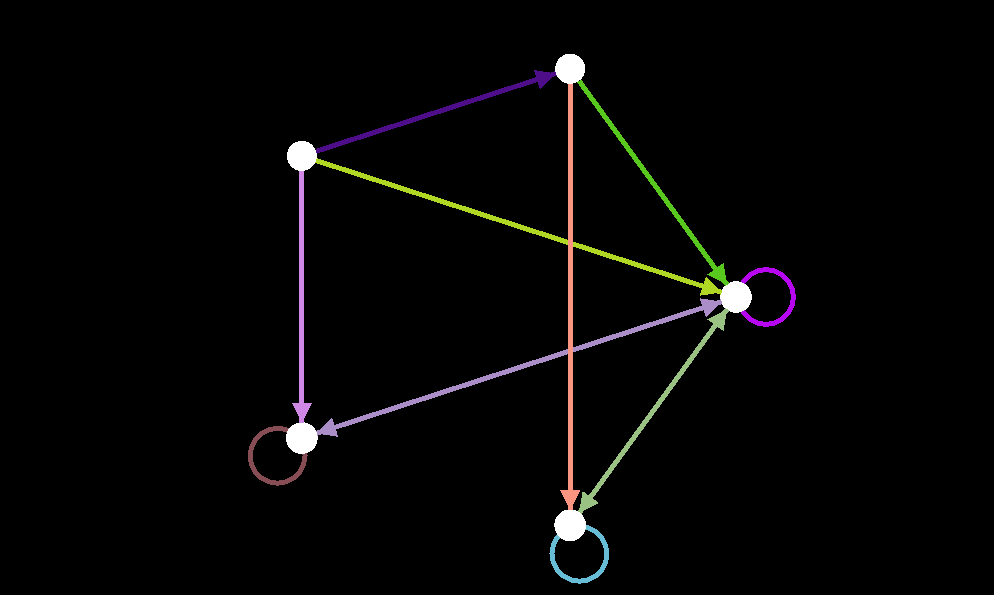
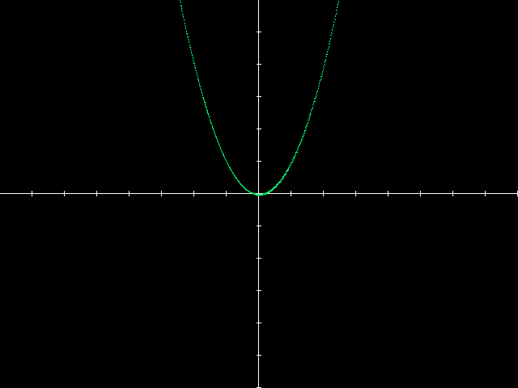

[](https://badge.fury.io/rb/silicium)
[](https://travis-ci.org/mmcs-ruby/silicium)
[](https://codeclimate.com/github/mmcs-ruby/silicium/maintainability)
[](https://codeclimate.com/github/mmcs-ruby/silicium/test_coverage)

# Silicium

Ruby Math Library written as exercise by MMCS students.


## Installation

Add this line to your application's Gemfile:

```ruby
gem 'silicium'
```

And then execute:

    $ bundle

Or install it yourself as:

    $ gem install silicium

## Usage
###   Graphs

#### Graph initialization
To create an empty graph just initialize an object:
```ruby
    g = OrientedGraph.new
    g = UnorientedGraph.new
````
Of course, you can determine vertices (name them whatever you want!). To do that, write something like:
```ruby
    g = OrientedGraph.new([{v: 0,     i: [:one]},
                          {v: :one,  i: [0, 'two']},
                          {v: 'two', i: [0, 'two']}])
```
You have to pass an `Array` of `Hashes`, each hash consists of pair of keys:
* v: vertex name;
* i: `Array` of adjacent vertices

Same goes for the case with unoriented graph (note that missing edges will be added automatically):
```ruby
    g = UnorientedGraph.new([{v: 0,     i: [:one]},
                           {v: :one,  i: [0, 'two']},
                           {v: 'two', i: [0, 'two']}])
```

=======
#### Graph Methods:
* Add vertex to your graph:
```ruby
    g.add_vertex!(Vertex)
```
* Add edge to your graph:
```ruby
    g.add_edge!(vertex_from, vertex_to)
```
* Get vertices adjacted with vertex: 
```ruby
    g.adjacted_with(vertex)
```
* Set label for the edge:
 ```ruby
     g.label_edge!(vertex_from, vertex_to, label)
 ```
* Get label for the edge:
 ```ruby
     g.get_edge_label(vertex_from, vertex_to)
 ```
* Set label for the vertex:
 ```ruby
     g.label_vertex!(vertex, label)
 ```
* Get label for the vertex:
 ```ruby
     g.get_vertex_label(vertex)
 ```
* Get number of vertices:
 ```ruby
     g.vertex_number
 ```
* Get number of edges:
 ```ruby
     g.edge_number
 ```
* Get number of vertex labels:
 ```ruby
     g.vertex_label_number
 ```
* Get number of vertex edges:
 ```ruby
     g.edge_label_number
 ```
* Check whether graph contains vertex:
 ```ruby
     g.has_vertex?(vertex)
 ```
* Check whether graph contains edge: 
 ```ruby
     g.has_edge?(vertex_from, vertex_to)
 ```
* Delete vertex:
 ```ruby
     g.delete_vertex!(vertex)
 ```
* Delete edge:
 ```ruby
     g.delete_edge!(vertex_from, vertex_to)
 ```
* Get array of vertices:
 ```ruby
     g.vertices
 ```

#### Graph algorithms:

* Check whether graph is connected:
 ```ruby
     g.connected?(graph)
 ```
* Breadth-First Search:
 ```ruby
     g.breadth_first_search?(graph, starting_vertex, searching_vertex)
 ```
* Algorithm of Dijkstra:
```ruby
     g.dijkstra_algorythm!(graph, starting_vertex)
```  
* Find Strongly Connected Components:
```ruby
     g.find_strongly_connected_components
```
* Algorithm of Dijkstra: dijkstra_algorythm!(graph, starting_vertex)


* Topological sort

#### Description
Topological sorting for Directed Acyclic Graph (DAG) is a linear ordering of vertices such that for every directed edge *u v*, vertex *u* comes before *v* in the ordering.

#### How to use
For you to have a topologically sorted graph, you need to create an object of the class ```Graph```:
``` ruby
    graph = Graph.new
```
Then you need to add vertices to this graph using the class ```Node```:
``` ruby
    graph.nodes << (node1 = Node.new(1))
    graph.nodes << (node2 = Node.new(2))
```
Due to the fact that only a directed graph can be sorted topologically, it is necessary to add an edge:
``` ruby
    graph.add_edge(node1, node2)
```
And finally you can type:
``` ruby
    TopologicalSortClass.new(graph)
```

#### Result
The result for ```TopologicalSortClass.new(graph).post_order.map(&:to_s)``` is [2, 1]


    Algorithm of Dijkstra: dijkstra_algorythm!(graph, starting_vertex)
    
    Algorithm of Kruskal: kruskal_mst(graph)
    
### GraphVisualiser

#### Set window size
	
```ruby
change_window_size(1000, 600)
```

#### Set graph
	
```ruby
graph = OrientedGraph.new([{v: :one, i:  [:one, :two, :four]},
                           {v: :two, i:[ :one, :two]},
                           {v: :five, i:[ :one,:three, :four]},
                           {v: :four, i:[ :one, :four]},
                           {v: :three, i:[ :one, :two]}])
set_graph(graph)
```

#### Show your graph
	
```ruby
show_window
```

#### Result




### Plotter

#### Determine your function

```ruby
def fn(x)
  x**2
end
```

#### Set scale

```ruby
# 1 unit is equal 40 pixels
set_scale(40)
```

#### Draw you function

```ruby
draw_fn(-20, 20) {|args| fn(args)}
```

#### Show your plot

```ruby
show_window
```

#### Result


=======
### Numerical integration

Library `Numerical integration` 
includes methods for numerical integration of functions, such as 3/8 method, Simpson method, left, right and middle rectangle methods and trapezoid method.

Each function accepts 4 parameters, such as left and right integration boundaries, default accuracy of 0.0001 and the function itself.
Example: `three_eights_integration(4, 5, 0.01) { |x| 1 / x }` or `three_eights_integration(4, 5) { |x| 1 / x }`

For example, to integrate 1 / x  in between [4, 5] using the 3/8 method, you need to use: 
`NumericalIntegration.three_eights_integration(4, 5) { |x| 1 / x }`

using the Simpson's method: 
`NumericalIntegration.simpson_integration(4, 5) {  |x| 1 / x  }`

using the left rectangle method: 
`NumericalIntegration.left_rect_integration(4, 5) {  |x| 1 / x  }`

using the right rectangle method: 
`NumericalIntegration.right_rect_integration(4, 5) {  |x| 1 / x  }`

using the middle rectangle method:
`NumericalIntegration.middle_rectangles(4, 5) {  |x| 1 / x  }`

using the trapezoid method: 
`NumericalIntegration.trapezoid(4, 5) {  |x| 1 / x  }`

=======
###Geometry 
Module with geometry functions and geometry structures
How to initialize the line with two points:
```
 line = Line2dCanon.new(point1, point2)
```
How to initialize the line with coefficients:
```
line.initialize_with_coefficients(a, b, c)
```
How to check if two lines are parallel:
```
line1.parallel?(line2)
```
How to check if two lines are intersecting:
```
line1.intersecting?(line2)
```
How to check if two lines are perpendicular:
```
line1.perpendicular?(line2)
```
How to get the distance between two parallel lines:
```
line1.distance_between_parallel_lines(line2)
```
How to check if the point is on segment:
```
line.check_point_on_segment(point)
```
How to check if array of points is on the same line:
```
line.array_of_points_is_on_line(array_of_points)
```
How to get a distance from point to line:
```
distance_point_to_line(point)
```
How to get a distance from point to plane:
```
plane.distance_point_to_plane(point)
```
How to check if the point is on plane:
```
plane.point_is_on_plane?(point)
```

How to initialize a plane with 3 points:
```
plane = Plane3d.new(point1, point2, point3)
```
How to initialize a plane with coefficients:
```
plane.initialize_with_coefficients(a,b,c,d)
```
How to get the distance between parallel planes:
```
plane1.distance_between_parallel_planes(plane2)
```
How to check if two planes are perpendicular:
```
perpendicular?(other_plane)
```
How to check if two planes are intersecting in 3-dimensional space:
```
plane1.intersecting?(plane2)
```
How to check if two planes are parallel in 3-dimensional space:
```
plane1.parallel?(plane2)
```
How to get a normal vector:
```
norm = vector_a.norm_vector(point2, point3)
```
How to check if two vectors are collinear:

```
  vector1.collinear?(vector2)
```
How to get a vector multiplication of two vectors:
```
  vector1.vector_multiplication(vector2)
```

### Theory of probability

#### Combinatorics
Module with usual combinatorics formulas
```
    factorial(5) # 5! = 120
    combination(n, k) # C(n, k) = n! / (k! * (n-k)!)
    arrangement(n, k) # A(n, k) = n! / (n - k)!
```
#### Module Dice

Module describing both ordinary and unique dices 

You can initialize a Polyhedron by two ways

first: by number - Polyhedron.new(6) - creates polyhedron with 6 sides [1,2,3,4,5,6]

second: by array - Polyhedron.new([1,3,5]) - creates polyhedron with 3 sides [1,3,5]
```
class Polyhedron
    csides # sides number
    sides  # array of sides
    throw # method of random getting on of the Polyhedron's sides
```

Example

```
d = Polyhedron.new(8)
d.csides # 8
d.sides # [1,2,3,4,5,6,7,8]
d.throw # getting random side (from 1 to 8)

d1 = Polyhedron.new([1,3,5,6])
d1.csides # 4
d1.sides # [1,3,5,6]
d1.throw # getting random side (from 1 or 3 or 5 or 8)
```

#### Class PolyhedronSet

You can initialize PolyhedronSet by array of:

Polyhedrons

Number of Polyhedron's sides

Array of sides
```
class PolyhedronSet
    percentage # hash with chances of getting definite score
    throw   # method of getting points from throwing polyhedrons
    make_graph_by_plotter # creating graph introducing chances of getting score
```

Example

```
s = PolyhedronSet.new([6, [1,2,3,4,5,6], Polyhedron.new(6)]) 

s.percentage # {3=>0.004629629629629629, 4=>0.013888888888888888, 5=>0.027777777777777776, 6=>0.046296296296296294, 
              # 7=>0.06944444444444445, 8=>0.09722222222222222, 9=>0.11574074074074074, 
              # 10=>0.125, 11=>0.125, 12=>0.11574074074074074, 13=>0.09722222222222222, 14=>0.06944444444444445, 
              # 15=>0.046296296296296294, 16=>0.027777777777777776, 17=>0.013888888888888888, 18=>0.004629629629629629}    

s.throw   # getting random score (from 3 to 18)

s.make_graph_by_plotter(xsize, ysize) # creates a graph in 'tmp/percentage.png'
```
## Module BernoulliTrials

Module allows find the probability of an event occurring a certain number of times for any number of independent trials.

```
n - count of independent trials
k - count of successful events
p - probability of succesful event (k / n)
q - probability of bad event (1 - p)

We have either the probability of event (p) or datas to calculate it (p = suc / all)

For small n probability is calculated by the Bernoulli formula C(n,k) * (p ^ k) * (q ^ (n-k))
For big n probability is calsulated by the Laplace theorem f((k - n*p)/sqrt(n*p*q)) / sqrt(n*p*q) 
Auxiliary Gaussian function F(x) = exp(-(x^2/2)) / sqrt(2*PI), F(-x) = F(x)

Laplace theorem give satisfactory approximation for n*p*q > 9
```

Example

```
--- Number 1 ---
Probability of making a detail of excellent quality is 0.75.
Probability that out of 400 parts, 280 will be of high quality.

n = 400, k = 280, p = 0.75, q = 0.25

n * p * q > 9, that Laplace theorem

F((280-300) / sqrt(75)) = F(-2.31) = F(2.31) = F(exp(-(2.31^2)/2) / sqrt(2*3.14)) = 0.0277
P = 0.0277 / sqrt(75) = 0.0032

--- Number 2 ---
Of 100 batteries, 7 breaks down during a year of storage.
Choose 5 batteries at random. 
Probability that among them 3 are serviceable.

n = 5, k = 3, all = 100, suc = 7
p = 7 / 100 = 0.07, q = 0.93

n * p * q < 9, that Bernoulli formula
P = C(5,3) * (0.93^3) * (0.07^2) = 0.0394
```


### Matrix

#### Method Gauss and Kramer

We have added Two methods for solving a system of linear equations: Gauss and Kramer.

The Gauss method is implemented as a function, and the Kramer rule is implemented as a method for the Matrix class.

To use the Gauss method, you need to call it with a single argument-the matrix whose roots you want to find.

##### Example 
```ruby
gauss_method_sol(Matrix[[1,2,3,4,5],[0,1,-1,2,3],[0,1,-1,2,3],[0,2,-2,4,6]].row_vectors
```
##### Answer
```ruby
[-1,3,0,0]
```

To use Kramer's rule, you need to call it as a method of the Matrix class with an array argument containing the values of each expression of a system of linear equations
##### Example 
```ruby
Matrix[[2, -5, 3], [4, 1, 4], [1, 2, -8]].kramer([7,21,-11]
```
##### Answer
```ruby
[3,1,2]
```

### Machine Learnign Algorithms

### Backpropogation 
When you need to compute a gradient value for a really huge expression, that a good practise to use a backpropogation algorithm to enhance the speed and quality of work. First, you needed a construct a Computational Graph, what makes our works more effective than it will be by using a  common Gradient Decent
```ruby
my_graph = Comp_Graph.new("(x*W1+b1)*W2+b2")
```
Than, we initialize our parametrs:
```ruby
    variables = Hash["x",1.0,"W1",1.0,"b1",1.0,"W2",1.0,"b2",1.0]
```
Finally, we can start to start training! The values will pass forward throw the graph and return the result of results of neural net(in theory)
```ruby
    computed_value = my_graph.ForwardPass(variables)
```

When it's done, we can use it to compute the curreny of result by loss function(at this example it's just a half of difference between values) and than start to move back, but now we compute the gradient value
```ruby
    trivial_loss = (expected_value - computed_value) * 0.5
    grad =  my_graph.BackwardPass(trivial_loss)
```

That's it! The last thing to do is apply gradient value to inserted parametrs, depended on value of learning speed(learn_rate)
```ruby
    learn_rate = 0.01
    variables["W1"] += grad["W1"]*learn_rate
    variables["W2"] += grad["W2"]*learn_rate
    variables["b1"] += grad["b1"]*learn_rate
    variables["b2"] += grad["b2"]*learn_rate
```
After a lot of repeating we will move closer to the perfect values of hyperparametrs in the net

### Optimization

#### Karatsuba multiplication
The Karatsuba algorithm is a fast multiplication algorithm. It reduces the multiplication of two n-digit numbers to at most )  single-digit multiplications in general. It is therefore faster than the traditional algorithm, which requires ) single-digit products.

##### Example:
```ruby
   karatsuba(15, 15) #returns 225
```


## Development

After checking out the repo, run `bin/setup` to install dependencies. Then, run `rake test` to run the tests. You can also run `bin/console` for an interactive prompt that will allow you to experiment.

To install this gem onto your local machine, run `bundle exec rake install`. To release a new version, update the version number in `version.rb`, and then run `bundle exec rake release`, which will create a git tag for the version, push git commits and tags, and push the `.gem` file to [rubygems.org](https://rubygems.org).

## Contributing

Bug reports and pull requests are welcome on GitHub at https://github.com/mmcs-ruby/silicium. This project is intended to be a safe, welcoming space for collaboration, and contributors are expected to adhere to the [Contributor Covenant](http://contributor-covenant.org) code of conduct.

## License

The gem is available as open source under the terms of the [MIT License](https://opensource.org/licenses/MIT).

## Code of Conduct

Everyone interacting in the Silicium project’s codebases, issue trackers, chat rooms and mailing lists is expected to follow the [code of conduct](https://github.com/[USERNAME]/silicium/blob/master/CODE_OF_CONDUCT.md).

### Method Gauss–Seidel
Use the-Gauss Seidel Method to solve a system of linear equations

Members containing x are written to an array of arrays in a. Free members are written in b. Condition for ending the Seidel iteration process when the epsilon accuracy is reached.

Example 
```
gauss_seidel(a,b,eps)
g = gauss_seidel(([[0.13,0.22,-0.33,-0.07],[0,0.45,-0.23,0.07],[0.11,0,-0.08,0.18],[0.08,0.09,0.33,0.21]]),[-0.11,0.33,-0.85,1.7], 0.001)

```

Answer:

```
g = [-1,1,9,-6]
```